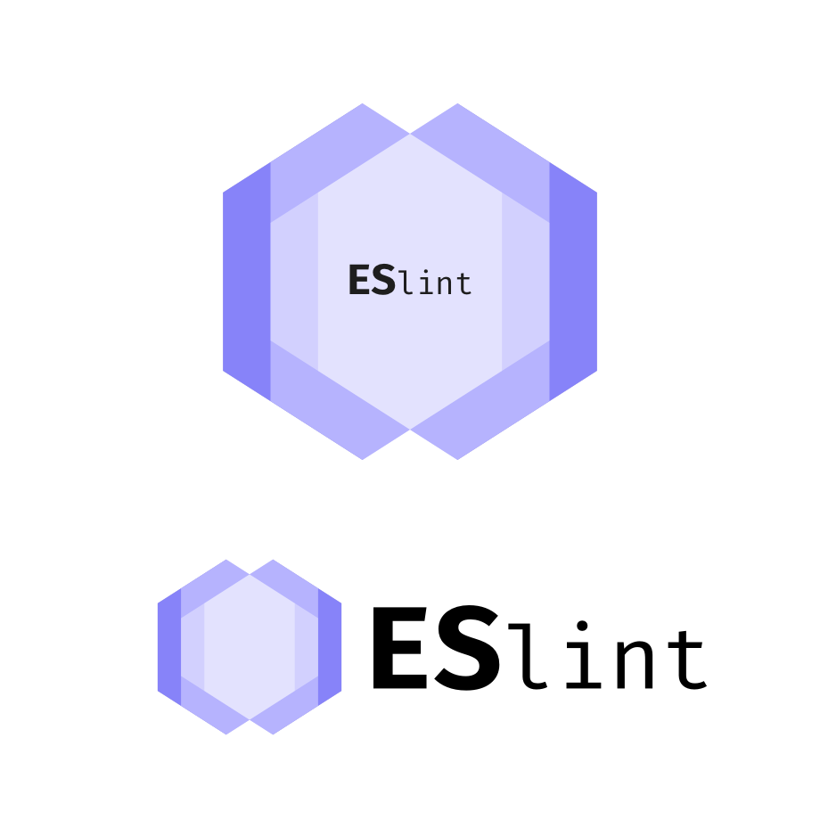

## My Way of Coding 

Ever since I started coding, I was always stressed to write my code so that another programmer, whether it be a group member or the person grading my code, code easily understand what I was doing. It was never introduced to me as a coding standard. My professor simply showed us an example of how code should be organized and documented. Through all my programs during that semester, I would "style" my code to look almost like my professors. I tweaked my code so that I code better understand it. For example, my indentations for variable calls were different from my indentations of statements so that I could visually know where my variables were. I coded in a way so that I wouldn't be confused, which made it easier for others to understand what I did. I continued to code this way as I learned other languages such as C++ and Javascript.

## IntelliJ IDEA and ESLint

As I began using IntelliJ and ESLint, I noticed that a bunch of red lines would appear frequently when I wrote simple programs that I could regularly program immediately. At first, I found that this happening was bothersome. Although after a few programs, I started to get used to it. I liked the fact that seeing these red lines allowed me to fix my mistakes immediately other than finding out I have errors when I attempt to run the program. I feel that ESLint has significantly shorten my time to debug a program. Seeing a green check mark relieves me of worrying about syntax errors. From my experience with ESLint so far, I spend more time fixing run-time errors than syntax errors. 
