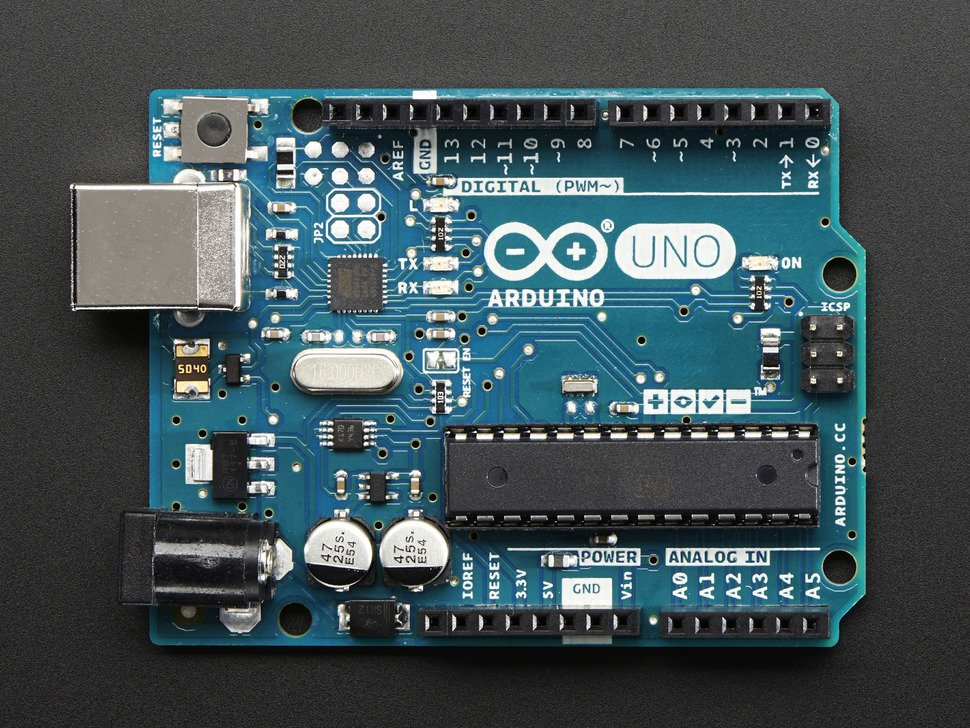

  
  

For this project, my partner and I were assigned to develop something using Arduino. We decided to measure the force of a punch by using an accelerometer. We attached the accelerometer to a boxing glove, along with an Arduino board and a small display. The accelerometer would measure the XYZ accelerations of a punch while our board would use that information to calculate an estimated force, which would then appear on the display.

This project introduced me to applying software to hardware using Arduino. I learned about how to program a board and cooperate with other pieces of hardware connected to it.
