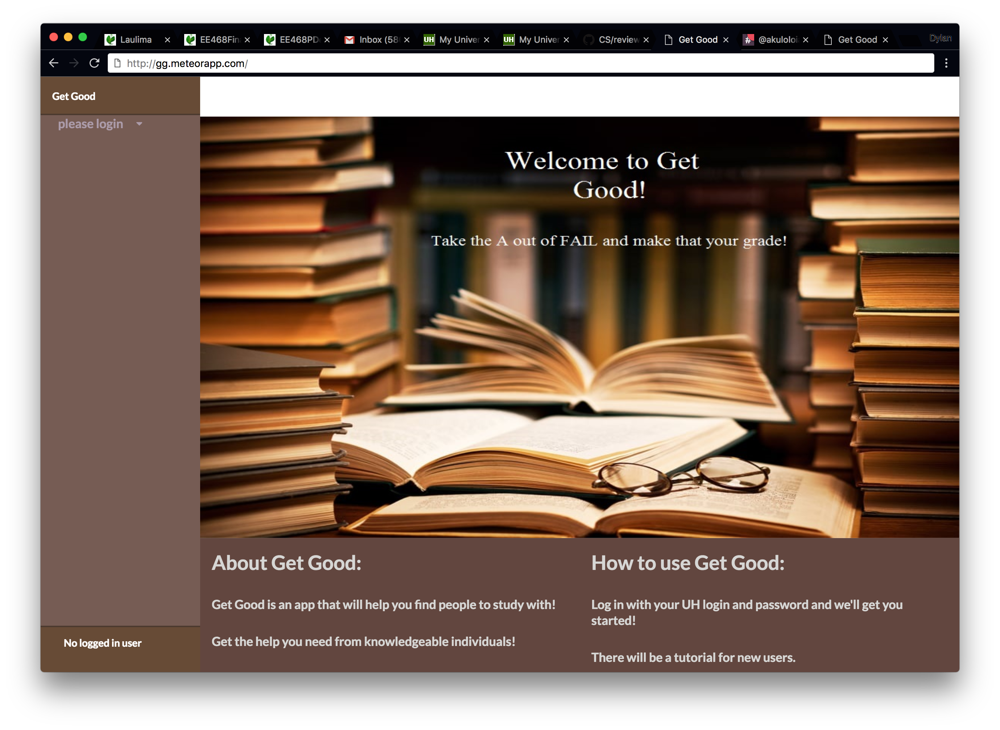

  

For this project, I worked with a team to develop a web app allowing ICS students in UHM to study together in the ICSpace (A room designated for ICS students to study). Students using our app could plan an event asking for help on a certain course. Other students would see their call for help and plan a session with each other. An embedded calendar was used to schedule events and sessions. Users were allowed to rate the students that helped them, which was used to show rankings between students. This allowed for a slight competition allowing users to strive to become the best. Users had the ability to choose a profile picture, give some information about themselves, and choose which courses they wanted to offer or receive help in. More information about our app can be found [here](https://get-good.github.io/) on our GitHub organization home page.

Since I was in a small group, this project caused me to experience issue driven project managment. I definitely appreciate the fact that I can freely edit files that everyone is using without destroying any progress that my other group members have obtained. Overall, it was much easier to work in a team compared to my past experiences. This project also gave me more experience in web development and the usage of [Meteor](https://www.meteor.com/). Hopefully in the future, I'll be able to use these skills for my future career.
