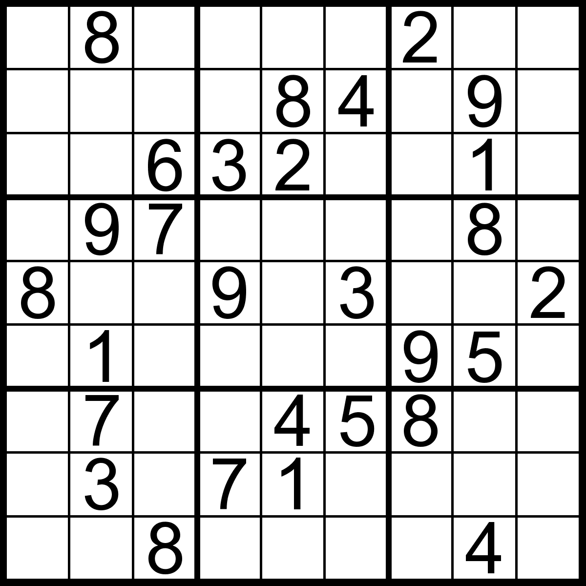

  
  

During my Spring semester of 2015, I was tasked near the end of my EE 205 course to create a game using C++ features. My group and I decided to program a sudoku solver for the game sudoku. We also decided that this game would be played on the terminal shell instead of a fancy GUI. Our game would prompt a player to select a difficulty and then use the sudoku solver to generate a random board given the difficulty. The player would then navigate to the empty spaces of the board and attempt to solve the puzzle. If the user thinks that they're done, they would then enter the check button which to check the players answers with the correct answers generated from the sudoku solver. If every number on the board was correct then the player wins.

From this project, I learned how to apply the extra features that C++ has to offer and how it differs from programming in C. C programs can seem to be very complicated compared to a program that does the same task in C++. 
